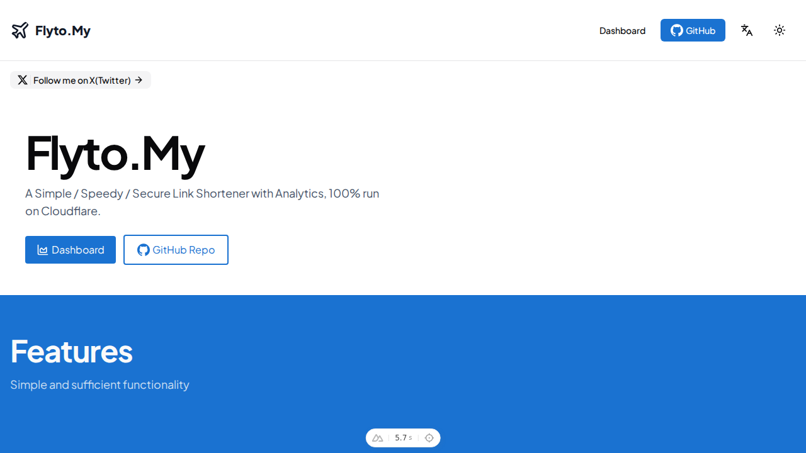
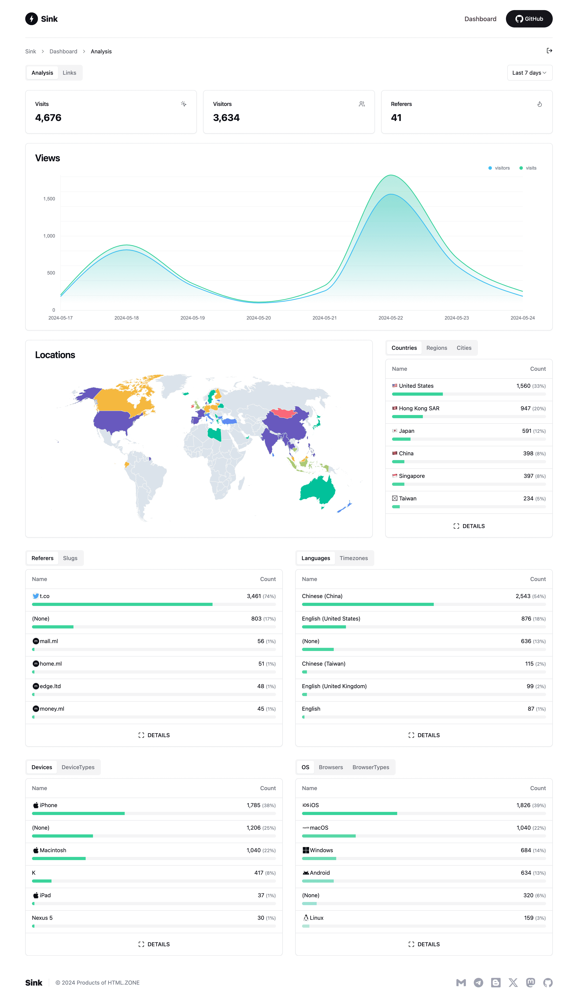
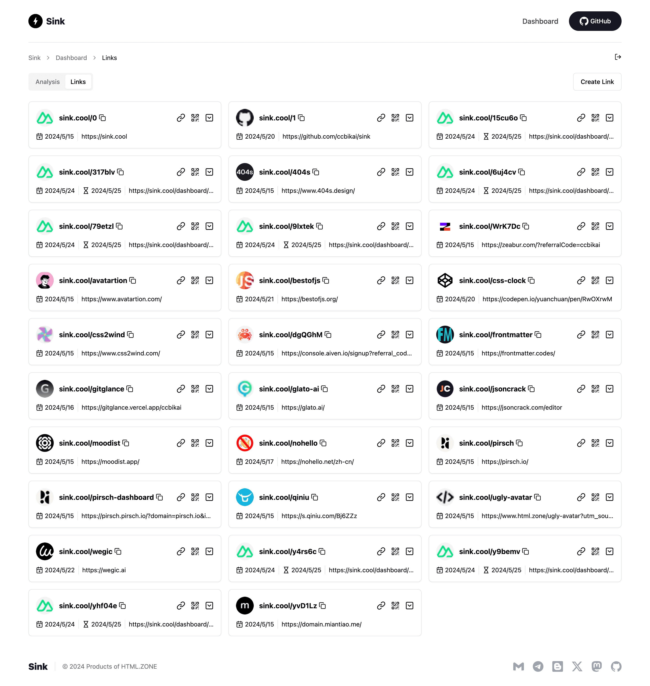
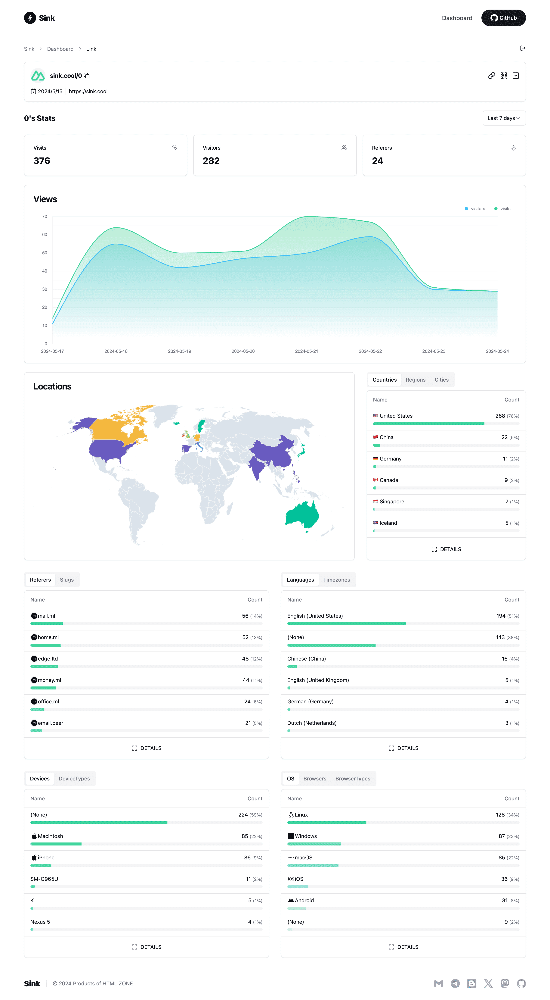

# ⚡ Sink

**A Simple / Speedy / Secure Link Shortener with Analytics, 100% run on Cloudflare.**

<a href="https://trendshift.io/repositories/10421" target="_blank">
  
</a>
<a href="https://news.ycombinator.com/item?id=40843683" target="_blank">
  
</a>
<a href="https://hellogithub.com/repository/57771fd91d1542c7a470959b677a9944" target="_blank">
  
</a>
<a href="https://www.uneed.best/tool/sink" target="_blank">
  
</a>

[](https://deepwiki.com/ccbikai/Sink)




----

## ✨ Features

- **URL Shortening:** Compress your URLs to their minimal length.
- **Analytics:** Monitor link analytics and gather insightful statistics.
- **Serverless:** Deploy without the need for traditional servers.
- **Customizable Slug:** Support for personalized slugs and case sensitivity.
- **🪄 AI Slug:** Leverage AI to generate slugs.
- **Link Expiration:** Set expiration dates for your links.

## 🪧 Demo

Experience the demo at [Sink.Cool](https://sink.cool/dashboard). Log in using the Site Token below:

```txt
Site Token: SinkCool
```

<details>
  <summary><b>Screenshots</b></summary>
  
  
  
</details>

## 🧱 Technologies Used

- **Framework**: [Nuxt](https://nuxt.com/)
- **Database**: [Cloudflare Workers KV](https://developers.cloudflare.com/kv/)
- **Analytics Engine**: [Cloudflare Workers Analytics Engine](https://developers.cloudflare.com/analytics/)
- **UI Components**: [Shadcn-vue](https://www.shadcn-vue.com/)
- **Styling:** [Tailwind CSS](https://tailwindcss.com/)
- **Deployment**: [Cloudflare](https://www.cloudflare.com/)

## 🚗 Roadmap [WIP]

We welcome your contributions and PRs.

- [x] Browser Extension
      - [Sink Tool](https://github.com/zhuzhuyule/sink-extension)
- [x] Raycast Extension
      - [Raycast-Sink](https://github.com/foru17/raycast-sink)
- [x] Apple Shortcuts
      - [Sink Shortcuts](https://s.search1api.com/sink001)
- [x] iOS App
      - [Sink](https://apps.apple.com/app/id6745417598)
- [ ] Enhanced Link Management (with Cloudflare D1)
- [ ] Analytics Enhancements (Support for merging filter conditions)
- [ ] Dashboard Performance Optimization (Infinite loading)
- [ ] Units Test
- [ ] Support for Other Deployment Platforms

## 🏗️ Deployment

> Video tutorial: [Watch here](https://www.youtube.com/watch?v=MkU23U2VE9E)

1. [Fork](https://github.com/ccbikai/Sink/fork) the repository to your GitHub account.
2. Create a project in [Cloudflare Pages](https://developers.cloudflare.com/pages/).
3. Select the `Sink` repository and choose the `Nuxt.js` preset.
4. Configure the following environment variables:
   - `NUXT_SITE_TOKEN`: Must be longer than **8** characters. This token grants access to your dashboard.
   - `NUXT_CF_ACCOUNT_ID`: Locate your [account ID](https://developers.cloudflare.com/fundamentals/setup/find-account-and-zone-ids/).
   - `NUXT_CF_API_TOKEN`: Create a [Cloudflare API token](https://developers.cloudflare.com/fundamentals/api/get-started/create-token/) with at least `Account.Account Analytics` permissions. [See reference.](https://developers.cloudflare.com/analytics/analytics-engine/sql-api/#authentication)

5. Save and deploy the project.
6. Cancel the deployment, then navigate to **Settings** -> **Bindings** -> **Add**:
   - **KV Namespace**: Bind the variable name `KV` to a [KV namespace](https://developers.cloudflare.com/kv/) (create a new one under **Storage & Databases** -> **KV**).
   - **Workers AI** (_Optional_): Bind the variable name `AI` to the Workers AI Catalog.
   - **Analytics Engine**:
     - In **Workers & Pages**, go to **Account details** on the right side, find `Analytics Engine`, and click `Set up` to enable the free version.
     - Return to **Settings** -> **Bindings** -> **Add** and select **Analytics engine**.
     - Bind the variable name `ANALYTICS` to the `sink` dataset.

7. Redeploy the project.
8. Update code, refer to the official GitHub documentation [Syncing a fork branch from the web UI](https://docs.github.com/pull-requests/collaborating-with-pull-requests/working-with-forks/syncing-a-fork#syncing-a-fork-branch-from-the-web-ui).

## ⚒️ Configuration

[Configuration Docs](./docs/configuration.md)

## 🔌 API

[API Docs](./docs/api.md)

## 🙋🏻 FAQs

[FAQs](./docs/faqs.md)

## 💖 Credits

1. [**Cloudflare**](https://www.cloudflare.com/)
2. [**NuxtHub**](https://hub.nuxt.com/)
3. [**Astroship**](https://astroship.web3templates.com/)

## ☕ Sponsor

1. [Follow Me on X(Twitter)](https://404.li/kai).
2. [Become a sponsor to on GitHub](https://github.com/sponsors/ccbikai).
